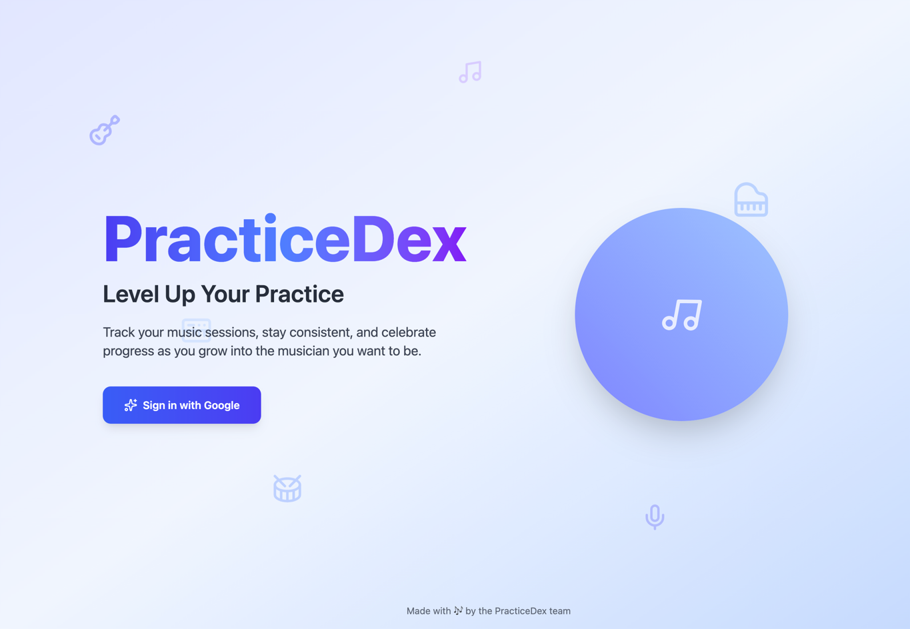
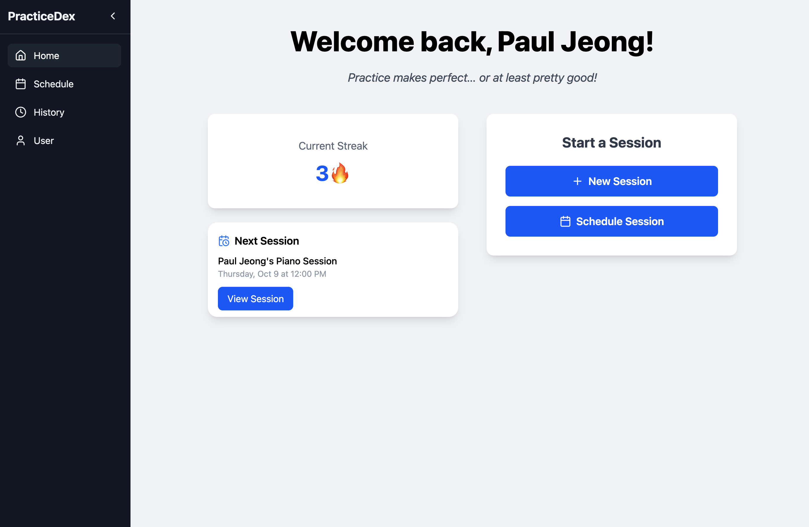
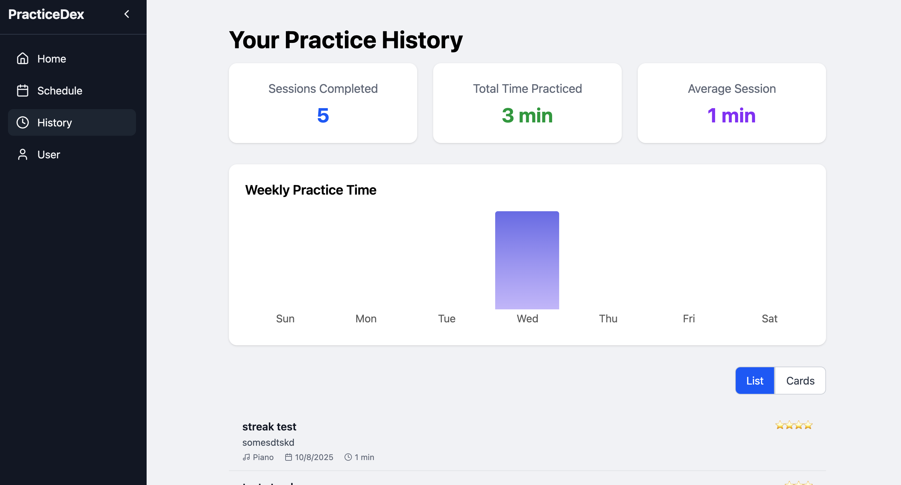

# PracticeDex 🎵📚

PracticeDex is a web application that helps musicians structure and track their practice sessions while making the process more engaging.  
Users can create practice sessions with time goals, track their progress, and earn rewards in a gamified environment.

<p align="center">
  
  
  
</p>

## Features
- ✨ New ✨ 🤖 PracticeCoach – Get personalized coaching and actionable insights to supercharge your practice sessions
- 🎼 Create and manage practice sessions with goals
- ⏱️ Timer-based tracking of session progress
- 📊 Progress dashboard with streaks and motivational quotes
- 🎸 Level up and unlock new musicians by practicing
- 🔐 Authentication & secure data storage with Firebase
- ☁️ AWS serverless backend for scalable session and user management

## Tech Stack
- **Frontend:** React, CSS
- **Backend:** AWS Lambda, API Gateway
- **Database:** AWS DynamoDB
- **Auth/Realtime:** Firebase
- **Storage:** AWS S3

## Project Goals
PracticeDex aims to make consistent practice fun and rewarding.  
It combines productivity tools with gamification to help users stay motivated and track their musical growth over time.

## Getting Started
1. Clone the repository:
 ```bash
 git clone https://github.com/pauljeong333/practicedex.git
 ```
2. Install dependencies:
  ```bash
  npm install
  ```

3. Set up environment variables for Firebase and AWS in a .env file.

4. Run the development server:
  ```bash
  npm start
  ```

## License

MIT License


---


